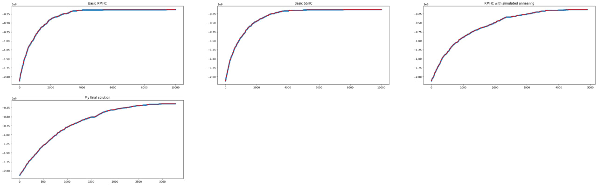
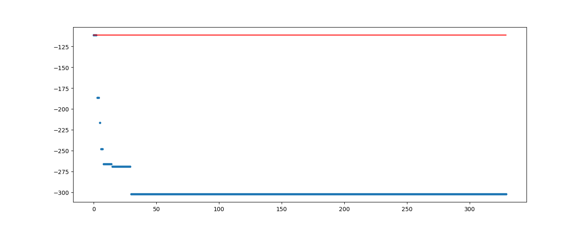
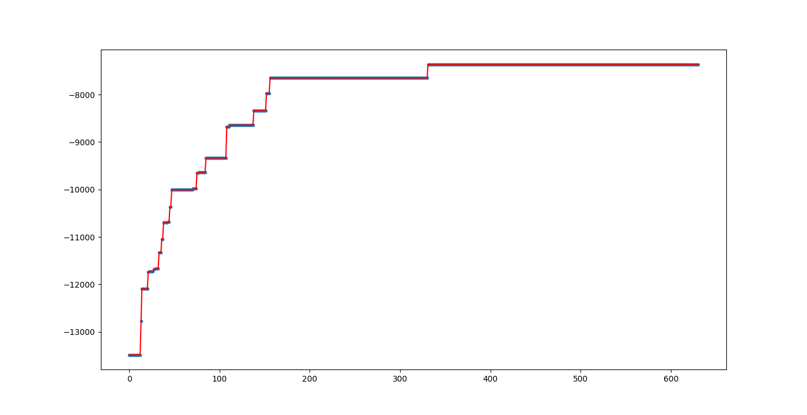
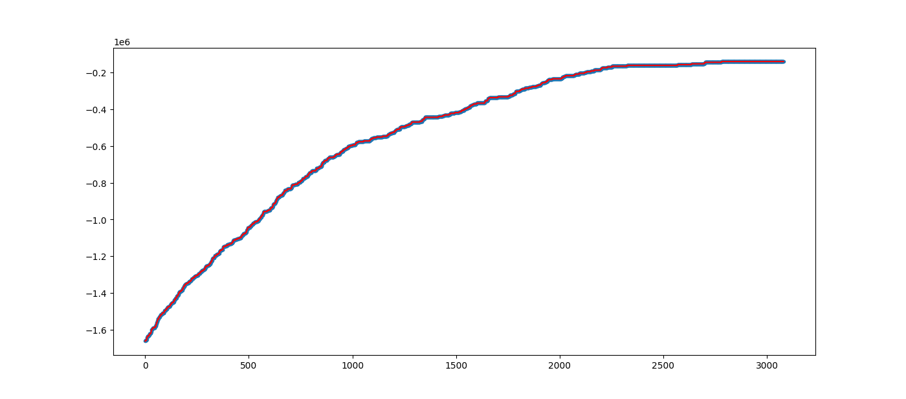
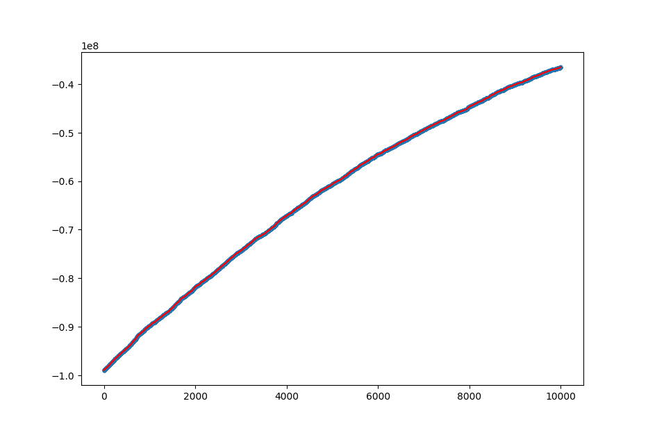
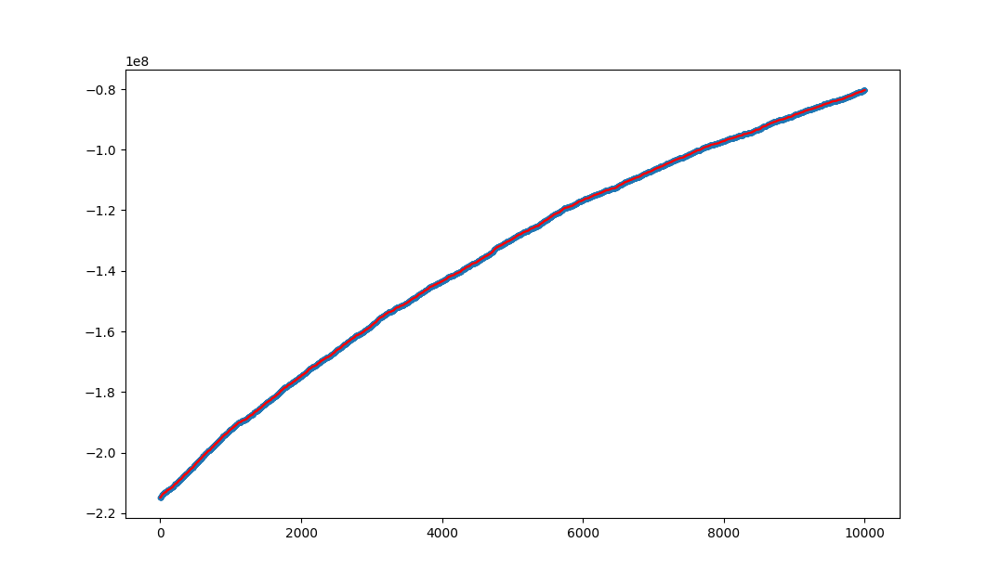
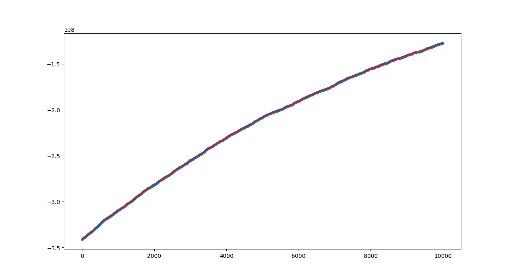

# CI2024_lab1

> Author: `Daniel Bologna - s310582`

- [CI2024\_lab1](#ci2024_lab1)
  - [The algorithm](#the-algorithm)
    - [The fitness function](#the-fitness-function)
    - [The tweak function](#the-tweak-function)
    - [The step size](#the-step-size)
    - [Stopping condition](#stopping-condition)
    - [Some comparisons](#some-comparisons)
  - [Results!](#results)
    - [Instance 1](#instance-1)
    - [Instance 2](#instance-2)
    - [Instance 3](#instance-3)
    - [Instance 4](#instance-4)
    - [Instance 5](#instance-5)
    - [Instance 6](#instance-6)
  - [Conclusions](#conclusions)
  - [CREDITS](#credits)

## The algorithm

### The fitness function
I started from a simple RMHC seen during the lecutres about 1-max and knapsack problems. From there I build my `fitness function` based on that presented by the Professor, outputting a tuple `(valid, -cost)`. 

> In certain conditions this fitness function given me invalid results, especially when starting with an empty starting solution.

To counter this problem I added the union of every taken items in our solution's subeset to check the current coverage (this idea came from a colleague I collaborated with):

```py
def fitness(_current_solution : np.ndarray) -> tuple[bool, float, float]:
    return (
        valid(_current_solution), 
        np.logical_or.reduce(SETS[_current_solution]).sum(), 
        -cost(_current_solution))
```

This allow the algorithm not to get stuck in a valley. Also, I think that this can be highly inefficient seen the amount of data used for computation, but I did not find better solution for now.

### The tweak function

For the tweak I decided to randomize a random amount of element from the current solution, as seen during the knapsack problem lecture. Making some experiments I've that the results were slightly superior to the single mutation tweak.

### The step size

Another variation I added to the basic algorithm was the `step_size` which is used to select in the `tweak(.)` how many elments will be mutated. Also, I thought that this `step_size` could be changed based on the current solution:

- narrow the searching range every time we hit a better soluton;
- widening the searching range if we spend too much time in the same spot without improving.

```py
    ...
if new_fit > current_fit:
    ...
    current_step_size /= _alpha
    worsening_counter = 0
else:
    worsening_counter += 1
    if worsening_counter % STEP_THRESHOLD == 0:
        current_step_size *= _alpha
        ...
```

`alpha` is the value used to increase and decrese the `step_size`.

### Stopping condition

To stop early the iterations if stuck in a local optimum I also added a stopping condition:

```
...
# STOPPING CONDITION
# still no improvements for a longer amount of iterations.
if worsening_counter >= STOPPING_THRESHOLD:
    break
...
```

### Some comparisons

Here's some banchmarks of my algorithm compared to some basic algorithms (RMHC, SSHC, RMHC with simultated annealing):



## Results!

Here's the results for the lab's delivery:

| instance | Universe size | numset   | density | time   | subsets taken       | iterations | final cost         | 
|----------|---------------|----------|---------|--------|---------------------|------------|--------------------|
| 1        | 100           | 10       | 0.2     | 0.1s   | 10/10      (100%)   | 329        | 302.0139364608861  |
| 2        | 1000          | 100      | 0.2     | 1s     | 22/100     (22%)    | 630        | 7363.483501993478  |
| 3        | 10000         | 1000     | 0.2     | 2s     | 33/10000   (3.30%)  | 3080       | 140062.4213208448  |
| 4        | 100000        | 10000    | 0.1     | 37m    | 1452/10000 (14.52%) | 10000      | 36475716.28760221  |
| 5        | 100000        | 10000    | 0.2     | 38m    | 1492/10000 (14.92%) | 10000      | 80348389.19695286  |
| 6        | 100000        | 10000    | 0.3     | 40m    | 1513/10000 (15.13%) | 10000      | 127226872.1459068  |

> NOTE: due to the high exectution time I could run the instences 4 to 6 only once.

### Instance 1



### Instance 2



### Instance 3



### Instance 4



### Instance 5



### Instance 6



## Conclusions

I think that these results are ok, but with some new strategies and rethinking the problem from the start I can try to achive even better results. In future solution I'd like to introduce some annealing in my code, trying to find ways to escape local optimums.

Also, looking at the instances, the stopping condition seems to work only until instance 3. So I'd like to find some way to make the checks to stop the algorithm dynamic based on the problem size.

In conclusion, I feel to have learned a lot but I have to keep testing and experimenting. I'm eager to see other collegues's solution and discuss new ways to update and improve my solution.

## CREDITS

- Course's lectures;
- Professor's solutions from lectures about 1-max and knapsack problems;
- Discussed and collabrated with colleague Martina Plumari s317612.